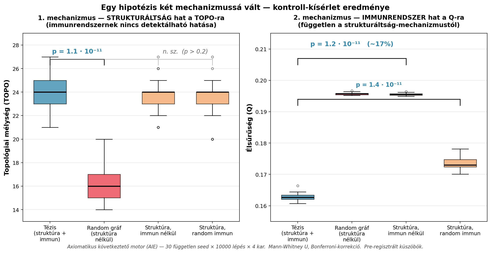

# Axiomatikus következtető motor (AIE)

> **Egy hipotézis, amit a saját kontroll-kísérlete kettéhasított.** Az eredeti egy-mechanizmus tézis ("a kauzális struktúra és az immunrendszer együtt építi a topológiai mélységet") a 30-seedes 4-karú strict-immune kísérletben **két független, statisztikailag szignifikáns mechanizmusra** vált szét.



## A két megerősített mechanizmus

| Mechanizmus | Hatás | Statisztika |
|---|---|---|
| **TOPO ← strukturáltság** | Strukturált kauzális regiszteren a topológiai mélység ~50%-kal magasabb mint random gráfon | Mann-Whitney U, **p = 1.1·10⁻¹¹** (n=30 seed) |
| **Q ← immunrendszer** | Az immunrendszer az élsűrűséget szabályozza | **p < 10⁻³ mindhárom regiszter-méreten** (15n / 15n-extra-dense / 48n); az effektus mérete regiszter-méret-függő (kis méreten saturáció: ~0.6%, 48n-en ~17%) |
| **TOPO ⊥ immunrendszer** | Az immunrendszer **nem** befolyásolja a topológiai mélységet | p > 0.3 mindenhol |

A két mechanizmus **független** és **különböző gráf-tulajdonságot ír**. Ez gazdagabb és pontosabb tézis, mint az eredeti egy-mechanizmus kép volt.

**Mire való ez a repó:**
- **Reprodukálható kísérleti keret** AIE-re: kontroll-regiszter generátorok, batch runner (30 seed, párhuzamos workerek), Mann-Whitney U + Bonferroni, TOPO dinamika, falszifikációs assertion
- **Pre-regisztrációs protokoll** — a hipotézisek küszöbei a futás ELŐTT rögzítve ([EXPERIMENT_IMMUNE_DENSITY.md](EXPERIMENT_IMMUNE_DENSITY.md))
- **40 unit teszt** a kernel és kísérleti infrastruktúra mellett

## Dokumentumok

- **[THEORY.md](THEORY.md)** — átfogalmazott tézis: két szétválasztott mechanizmus
- **[EXPERIMENT_IMMUNE_DENSITY.md](EXPERIMENT_IMMUNE_DENSITY.md)** — a kontroll-kísérlet pre-regisztrációja, eredményei, és verdict-je
- **[EXPERIMENT_PRIORITY.md](EXPERIMENT_PRIORITY.md)** — C kísérlet: priority_weight mechanizmus tesztje (cáfolt elsődleges hipotézis + nyitott post-hoc megfigyelés)
- **[EXPERIMENT_D.md](EXPERIMENT_D.md)** — D kísérlet: 2D dizájn (priority × adjacency) confound-free setupon — új saturációs confound felfedezve, a 4. mechanizmus sorsa továbbra is nyitott
- **[experiments/README.md](experiments/README.md)** — hogyan futtasd újra a kísérleteket (~10-15 perc compute)
- **[EXPERIMENT_TIMELESS.md](EXPERIMENT_TIMELESS.md)** — történeti: az "időtlen univerzum" eredeti kísérleti elgondolás
- **[ROADMAP.md](ROADMAP.md)** — fejlesztési fázisok

### Followup observation (nyitott kérdés)

A C kísérletben (priority_weight mechanizmus) a pre-regisztrált elsődleges hipotézis **cáfolódott** (priority NEM koncentrálja a TOPO-mélyülést a magas-priority csúcsokra, p=0.97 a vártnak ellentétes irányban). A post-hoc analízis viszont egy **új mintázatra** mutatott: a priority-eloszlás a heurisztikán keresztül **drasztikusan átrendezi** az immunrendszer aktivitását (RRR a `priority_thesis` 0.31-tól a `priority_inverted` 0.98-ig terjed, Mann-Whitney p = 6·10⁻⁹).

Ez egy **post-hoc megfigyelés**, **nem megerősített mechanizmus**. A D kísérlet (2D dizájn priority × adjacency, confound-free `n_nodes=15` setupon) **nem tudta értékelni** — egy új confoundba ütközött (RRR-saturáció a kis gráfon, minden karon RRR ≈ 1.0). Tehát a 4. mechanizmus sorsa továbbra is **nyitott**: nem cáfolt, nem megerősített. Az E kísérlet (közbülső paraméter-tartomány: n_nodes ≈ 30–40, csökkentett immun-sűrűség) érlelődik.

Lásd részletesen: [EXPERIMENT_PRIORITY.md](EXPERIMENT_PRIORITY.md) (C kísérlet) és [EXPERIMENT_D.md](EXPERIMENT_D.md) (D kísérlet).

## Gyors reprodukció

```bash
pip install -r requirements.txt
python -m unittest discover tests           # 40 unit teszt
bash experiments/run_strict_all.sh          # 8 kar × 30 seed × 10000 lépés (~10 perc)
python -m experiments.aggregate --manifest experiments/runs/timeless_strict/manifest.json
python -m experiments.mann_whitney \
    --timeless-manifest experiments/runs/timeless_strict/manifest.json \
    --control-manifest experiments/runs/random_strict/manifest.json \
    --metric topo --direction greater
```

---

## Technikai dokumentáció — AIE engine

A továbbiakban a kernel és a chat-csatorna technikai leírása.

Ez a mappa egy **irányított axióma-gráfot** (NumPy mátrix) tart karban, rajta **Q-sűrűséget** és **N\*** jellegű metrikákat számol, és opcionálisan **policy** (YAML) alatt **daemon / felfedező** üzemmódot futtat. A cél: strukturált „logikai hálózat” + mérhető feszültség (klasszikus vs. kvantum stb.), nem egy teljes LLM.

A dokumentációban és a `THEORY.md`-ben az **„idő” / időnyíl** kifejezés **kauzális irányítás és topológiai mélység** metaforája (irányított láncok, aszimmetria, immun) — **nem** beépített naptári óra; a `sleep` csak ütemezés.

## Fő fájlok

| Fájl | Szerep |
|------|--------|
| `axiom_kernel.py` | **AxiomaticInferenceEngine**: tudásmátrix, `verify_logic` (deduktív tranzitív lépés), `think_step` / `think_loop`, Q, makro–mikro távolság, hipotézis (abduktív) él, pillanatkép (`format_last_think_ascii`), `derive_statement`. |
| `axiom_registry.py` | **AxiomRegistry**: `axioms_registry.json` betöltése — csúcsok, kulcsszavak, `causal_edges`, `forbidden_edges`, `logical_negation_pairs`. |
| `axioms_registry.json` | Axiómák listája (id, domain, formula, kulcsszavak), explicit élek és tiltások. Katalizátor-példák: `causal_loop`, `feedback_backpropagation`, `measurement_distortion` (readout torzítás). |
| `axioms_registry_timeless.json` | Szűrt regiszter: nincs `entropy_2nd` / `boltzmann_entropy` / `time_arrow` (időtlen bázis kísérlethez). Újra: `python tools/build_timeless_registry.py`. |
| `tools/build_timeless_registry.py` | Az időtlen JSON újragenerálása a fő regiszterből. |
| `tools/telemetry_fisher_sweep.py` | Telemetria **Q** idősor → **Fisher-trace sweep** (heurisztikus N\*); összevetéshez: külön Grammar/Fisher archívum. |
| `aie_http_server.py` | **HTTP API** (stdlib): `GET /health`, `/status`, `POST /chat` JSON — `aie_chat.process_chat_message` (REPL-parancsok nélkül). |
| `graph_metrics.py` | TOPO (topológiai mélység), ASYM (aszimmetria-arány), RRR segédfüggvények. |
| `policy_manager.py` | **PolicyManager**: `agi_policy.yaml` betöltése, hot-reload (mtime), discovery beállítások, CPU-alapú adaptív `sleep`, telemetria és max. futási idő. |
| `agi_policy.yaml` | Alap policy (küszöb, sleep, discovery alapértelmezések). |
| `agi_policy_daemon.example.yaml` | Daemon példa: magas CPU-cél, **lazított immun** (`ignore_forbidden_edges`, `ignore_negation_contradictions`), alacsony discovery-napló küszöb (`log_q_threshold`), telemetria → **`telemetry_relaxed.log`**, discovery → **`discovery_log_relaxed.txt`**, max. futás pl. 24 h, Hamilton-gyűrű daemon alapértelmezés szerint kikapcsolva. |
| `self_optimization.py` | **SelfOptimizationAdvisor**: Q stabil időszak után javaslatok (ritka mátrix, sleep, B emelés); **SystemMetrics** pillanatkép. |
| `run_daemon_test.py` | CLI: háttér `think_loop`; `--registry` JSON; `--status-every N` másodpercenként think-sor. Induláskor kiírja **PID** + **interpreter** útvonalat. |
| `aie_chat.py` | **Magyar csevegő (REPL)**: stdin/stdout, `communication/hu_rules.yaml` (small talk + üzenetek), üzenetek → `derive_statement`. Nem LLM — a gráf és a küszöb szabályozza a választ. |
| `communication/hu_rules.yaml` | Magyar **nyelvi / UX szabályok** (kulcsszavas válaszok, súgószöveg); szerkeszthető. |
| `aie_knowledge.py` | Regiszter → emberi szöveg: **negáció, tiltott élek, axióma-lista** (`/szabályok`, `/axiómák`). |
| `ROADMAP.md` | **Közös cél** fázisokban: zseni-szintű tudás + válasz + hipotézis + szabályok értése. |
| `hypotheses/` | Hipotézis-napló: `discovered_edges.jsonl` (**`hypothesis_sync.py`** vagy `/hipotézis-sync`); sablon: `journal_template.md`. |
| `hypothesis_sync.py` | Discovery napló → JSONL (él, Q, domain). |
| `quantum_ingestor.py` | Kvantum readout chunkok feldolgozása; összekapcsolható az AIE-vel (`derive_statement`). **Információs sokkterápia:** `python quantum_ingestor.py --shock` (nagy `max_rows` + nagy bájt-limit). |
| `daemon_mission.yaml` | Küldetés / checklist (dokumentáció jellegű). |
| `requirements.txt` | `numpy`, `PyYAML`, `psutil`. |

Futás közben keletkezhet: discovery- és telemetria-napló (policy szerinti fájlnévvel, pl. `telemetry.log` / **`telemetry_relaxed.log`**). Mindkettő tartalmaz **`PID=`** / **`pid=`** — több párhuzamos `python` ne írja ugyanazt a fájlt (Windows: a `python` parancs két interpretert is elindíthat). A telemetria egy sora: `Q`, `DIST(MACRO->MICRO)`, `B_EFFICIENCY`, **`TOPO`**, **`RRR`**, **`ASYM`** (részletek: `THEORY.md`).

**RRR** (reverse rejection rate): csak akkor nő, ha van **j→…→i** út és **i→j** próbánál **`contradiction`** lép fel; ha a policy kikapcsolja a negációs ellenőrzést, **RRR maradhat 0** (nem „hiba”, hanem a számláló logikája).

## Fogalmak

### Tudásmátrix és Q

- A gráf **irányított**: `knowledge_matrix[i,j] > 0` jelentése: „van `i → j` implikáció / él”.
- **Q**: az irányított élek sűrűsége (diagonális nélkül), normalizálva. Új (nem nulla) off-diagonális él → Q nőhet.
- **N\*** (a kódban): \(H_0 \cdot B \cdot C / \sqrt{Q}\) típusú képlet bemeneti entrópiával és meta-paraméterekkel (`backend_efficiency_b`, `coherence_c`).

### Deduktív vs. felfedező (hipotézis)

- **`verify_logic(i,j)`**: „deduktív”: van-e olyan `k`, hogy `i→k` és `k→j` (egy köztes lépés alapján tranzitíven igazolható-e `i→j`).
- **`add_edge_if_proven` / `_try_add_edge_with_reason`**: él felvétele csak akkor, ha **nem tiltott** (`forbidden_edges`) és **nem ellentmond** a `logical_negation_pairs` alapján (`_would_contradict_edge`).
- **Discovery (`discovery.enabled`)**: ha a verify **nem** igazol, a motor **hipotézisként** megpróbálja ugyanazt az élt — ha az immunrendszer (tiltás + negáció) **engedi**, felveszi (**abduktív** lépés), így a gráf kitapogathatja a „sötét” területet, és Q emelkedhet.

### Hamilton-gyűrű (mag vetés)

- Alapból (policy szerint) a mag inicializálhat egy **Hamilton-kört** (minden csúcs `i → i+1`), ami mesterségesen összeköti a csúcsokat és **lezárja a távolságmérőt**.
- **Daemon** profilban ez gyakran **ki van kapcsolva** (`seed_hamilton_ring`), hogy csak a JSON-beli **`causal_edges`** (+ identitás) induljon — így a makro–mikro távolság **inf**-ről indulhat, és csak valódi / hipotézis élek építenek hidat.

### Makro ↔ mikro távolság

- **`calculate_domain_distance`**: több domain-címkére is (listák); BFS a mátrixon — legrövidebb irányított út hossza két domain-halmag között (vagy inf).
- **`MACRO_DOMAIN_LABELS` / `MICRO_DOMAIN_LABELS`**, **`get_tension_report_ascii()`**: egy soros feszültség-jellegű összegzés.

### Policy: discovery, telemetria, max futás

- **`discovery`**: `enabled`, `daemon_mode`, `ignore_forbidden_edges`, **`ignore_negation_contradictions`** (kísérleti: a `logical_negation_pairs` nem utasít — ellentmondásos gráf lehetséges), napló küszöbök (`log_q_threshold`, `log_cross_domain_only`, `log_path`), `seed_hamilton_ring`, `telemetry_enabled`, `telemetry_every_n_steps`, `telemetry_log_path`, **`max_runtime_seconds`** (0 = korlátlan).
- **`run_daemon_test.py`**: a policy `max_runtime_seconds` (pl. 86400 = 24 h) után a `think_loop` leáll.

### Think pillanatkép és diagnosztika

- **`format_last_think_ascii()`**: utolsó `think_step` — mód (heurisztika / véletlen pár / üres), pár axióma id-kkel, `verify`, `hyp_edge`, `new_edge`, **`reject`** (ha nem lett él: `exists`, `forbidden`, `contradiction`, `no_hypothesis`, stb.).

## Magyar csevegő (chat-szerű REPL)

Interaktív csatorna a konzolon: **nem** nyelvi modell, hanem az AIE `derive_statement` + rövid **small talk** a YAML-ból.

```bash
pip install -r requirements.txt
python aie_chat.py
python aie_chat.py --registry axioms_registry.json --q-threshold 0.02
```

- **Parancsok:** `/help`, `/status`, `/warmup N` (gráf építés), `/quit`.
- **Tanítás (nem neurális):** `/learn trigger | válasz` (vagy `/tanul`) — mentés a `communication/hu_learned.yaml` fájlba; a felhasználó szövegében részegyezésre válaszol. `/learned` listázza. Előbb a tanult, aztán az alap `hu_rules.yaml` small talk, végül `derive_statement`.
- **Nyelvtan:** `communication/hu_grammar.yaml` — szerkeszthető szekciók; `/nyelvtan` vagy `/nyelvtan alap` (kulcs szerint).
- **Küszöb:** alap `--q-threshold 0.02` (demóhoz); éles policy szerinti értékhez állítsd közelebb a policy `q_threshold_base`-hez.
- **Bővítés:** HTTP/WebSocket később ráépíthető ugyanerre a API-ra; a szabályfájl marad a forrás.

Windows konzolban UTF-8: ha kell, `chcp 65001` vagy olyan terminál, ami UTF-8-at használ.

## Tipikus futtatás

```bash
pip install -r requirements.txt
python run_daemon_test.py --policy agi_policy_daemon.example.yaml --status-every 5
python run_daemon_test.py --registry axioms_registry_timeless.json --status-every 5
```

Állítás: **Ctrl+C** (a szkript `stop_thinking`-et hív).

**Windows — egy példány:** ha a sima `python run_daemon_test.py` kétszer futna (Store shim + Python core), futtasd **egy** explicit `python.exe` útvonallal (pl. `where.exe python` alapján választva), vagy nézd a szkript induláskor kiírt **`interpreter=`** sort.

Kódból:

```python
from axiom_kernel import AxiomaticInferenceEngine

engine = AxiomaticInferenceEngine(
    policy_enabled=True,
    policy_path="agi_policy_daemon.example.yaml",
)
engine.start_autonomous_thinking()
# … vagy szinkron: többször engine.think_step()
```

## Függőségek

- **NumPy** — mátrix és sűrűség.
- **PyYAML** — policy.
- **psutil** (opcionális, de ajánlott) — CPU-minta az adaptív sleephez.

## Opcionális: telemetria → Grammar / Fisher (külső szkriptek)

A **`QuantumCircuit/Grammar_Fingerprinting_Archive/Grammar_Fingerprinting_Code_and_Results_v1.0/`** mappában (az archívum **nem** része ennek a repónak) futtatható:

- **`run_grammar_fingerprint_readonly.py`** — `--mode telemetry`: SAX+LSTM **átmeneti mátrix** a telemetria **Q** (vagy `topo`, `rrr`, `concat5`, …) idősoráról; kimenet tetszőleges `--output-dir`-be, az archívum csak import.
- **`run_fisher_telemetry_sweep.py`** — Fisher-görbe **N** (mintaszám) mentén + becsült **N\*** (max \|d(trace)/dN\| heurisztika). **Nem** a Sycamore readout ~8000 „bizonyítéka”; a referenciavonal a grafikonon csak összehasonlítás. Hosszú log kell értelmes nagy-N görbéhez; nagy **N**-nél a Fisher-skálák numerikusan telítődhetnek — az **N\*** óvatosan értelmezendő.

Példa (útvonalat igazítsd a gépedhez):

```bash
python run_grammar_fingerprint_readonly.py --archive ".../QuantumCircuit_Grammar_Research_Archive" \
  --output-dir "./grammar_out" --mode telemetry \
  --telemetry-file "telemetry first.log" --telemetry-metric q --epochs 20

python run_fisher_telemetry_sweep.py --archive ".../QuantumCircuit_Grammar_Research_Archive" \
  --telemetry-file "telemetry first.log" --output-dir "./fisher_out" --telemetry-metric q
```

Ehhez a Grammar archívum **`requirements.txt`**-je (numpy, pandas, scipy, sklearn, matplotlib, …) szükséges.

---

*A részletes viselkedés (tiltások, negációs párok, konkrét axióma-id-k) mindig az `axioms_registry.json` és a választott policy együttesétől függ.*
